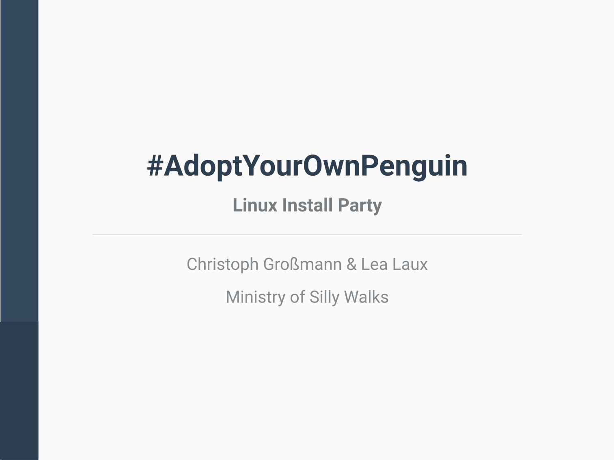

# \#AdoptYourOwnPenguin

Wanna see the which distros there are or their download ranking?

Go to [DistroWatch](https://distrowatch.com/)!

Wanna know which distro fits your needs?

Go to [DistroChooser](https://distrochooser.de/)!

## Presentation

## Bash Cheat Sheets

## License

 This work is licensed under a <a rel="license" href="http://creativecommons.org/licenses/by-sa/4.0/">Creative Commons Attribution-ShareAlike 4.0 International License</a>.
